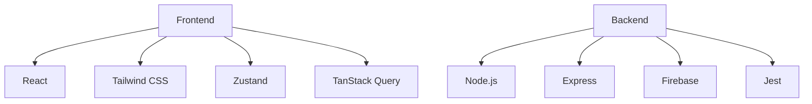
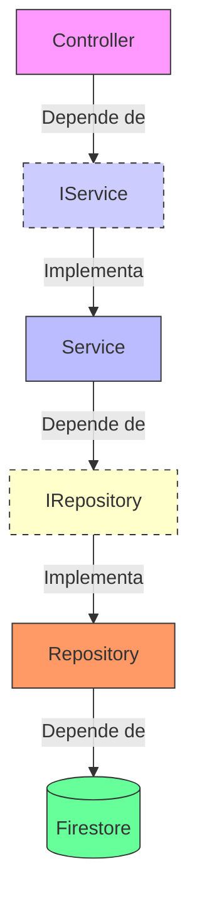
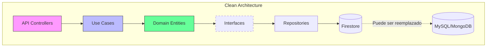

# 🍕 PizzaRush - Sistema de Pedidos de Pizza


## 📝 Descripción
**PizzaRush** es una prueba técnica para gestión de pedidos de pizza, desarrollada bajo principios SOLID con **React** y **Express**.

## 🚀 Características

### 📦 Backend
- ✅ Arquitectura por capas (Controller - Service - Repository)
- 🔥 Firestore Database + Firebase Auth
- 🧪 Testing con Jest
- 🔒 Sistema de roles (Admin / Usuario)

### 🎨 Frontend
- ⚛️ React + TanStack Query
- 🛒 Zustand para el estado del carrito
- 💅 Tailwind CSS + shadcn/ui
- 📱 Diseño 100% responsive

## 🛠️ Stack Tecnológico



## 🏗️ Arquitectura con Inversión de Dependencias



## 📈 Próximas Mejoras Técnicas

### 🏗️ Evolución Arquitectónica



### 🔄 Próximas Integraciones

| Área           | Mejora Propuesta                                                  | Prioridad |
|:----------------|:----------------------------------------------------------------|:-----------|
| **Frontend**     | Implementar React Testing Library para cobertura completa de tests | Alta      |
| **Backend**      | Migrar a Clean Architecture                                        | Media     |
| **Pagos**        | Integrar Stripe/PayPal para flujo completo de compra               | Crítica   |
| **Performance**  | Implementar caché con Redis para consultas frecuentes              | Media     |
| **CI/CD**        | Configurar GitHub Actions para despliegues automáticos             | Alta      |

## 📦 Instalación

```bash
# Clonar repositorio
git clone https://github.com/stevenjaimes/jr_fullstack_challenge_pizzarush.git

# Instalar dependencias
cd pizza-rush/backend && npm install
cd ../frontend && npm install

# Configurar variables de entorno
cp .env.example .env
```

## 🙏 Agradecimientos

Un especial agradecimiento a **[Coding Cloud](https://codingcloud.online/)** por este desafío técnico que permitió demostrar habilidades en:

- Arquitectura SOLID
- Integración con Firebase
- Desarrollo Fullstack
- Implementación de buenas prácticas

## 🌐 Demo

[🔗 Ver demo en vivo](https://pizza-rush-demo.com)

## 📄 Licencia

MIT © 2025 [Henry Steven Jaimes](https://linkedin.com/in/henry-steven-jaimes)

[](https://github.com/stevenjaimes)
